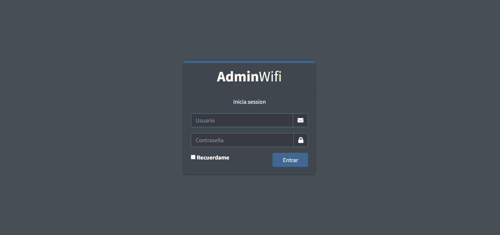
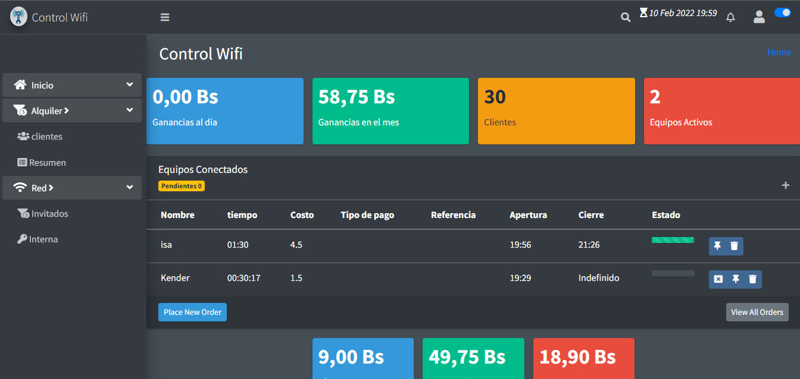
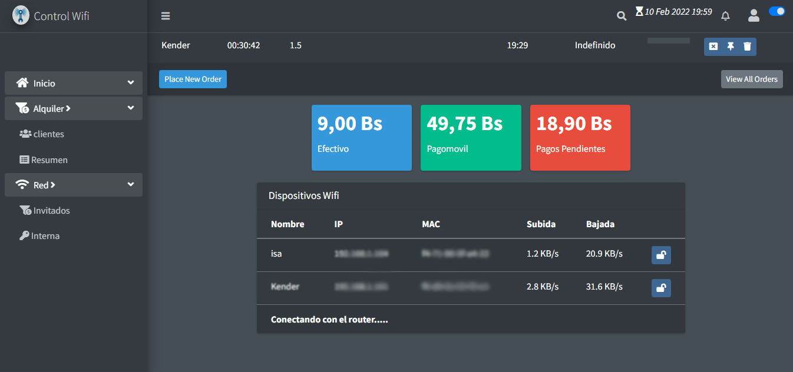
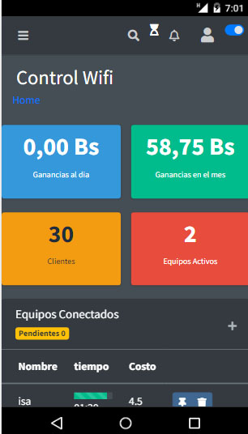
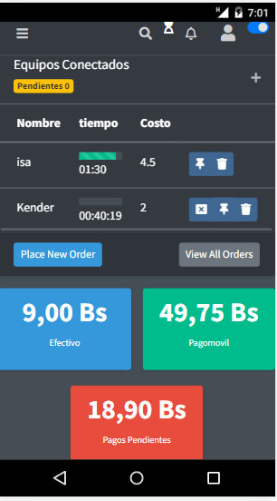
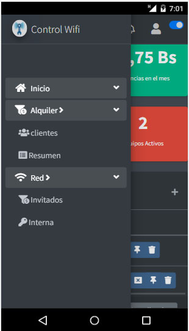

# WifiControl Front-End

> Sistema de control para el alquler de wifi por hora 
> Se sirve de la api [Back-End](https://github.com/ever23/wificontrol-BackEnd)








## Tecnoclogias usadas

> vue.js, html, css, socket.io

## Requerimientos 

1. node.js>=v14.17.6
2. npm

## Intalaccion

``` bash
# Instalar dependecias 
npm install

# inicia un servidor de desarrollo en localhost:8081
npm run dev

# compilacion 
npm run buld

