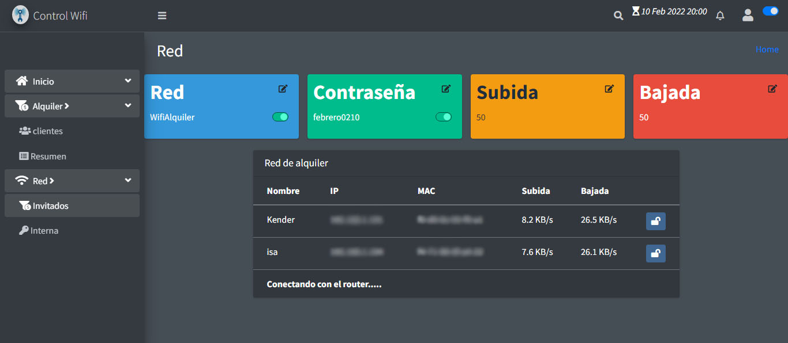

# WifiControl Front-End

> Sistema de control para el alquiler de wifi por hora usando un router de la marca Mercusys
> Asigna tiempo de conexion a la red wifi a un equipo y lo bloquea al finalizar el tiempo  
> puede modificar el nombre, contraseña, limite de subida y bajada de la red de invitados
> Control de clientes 
> Muestra en tiempo real los equipos conectados a la red y su trafico
> posibilidad de bloqueo y desbloqueo manual de equipos conectados a la red 
> Se sirve de la api [Back-End](https://github.com/ever23/wificontrol-BackEnd)





## Tecnoclogias usadas

> vue.js, html, css, socket.io

## Requerimientos 

1. node.js>=v14.17.6
2. npm

## Intalaccion

``` bash
# Instalar dependecias 
npm install

# inicia un servidor de desarrollo en localhost:8081
npm run dev

# compilacion 
npm run buld

